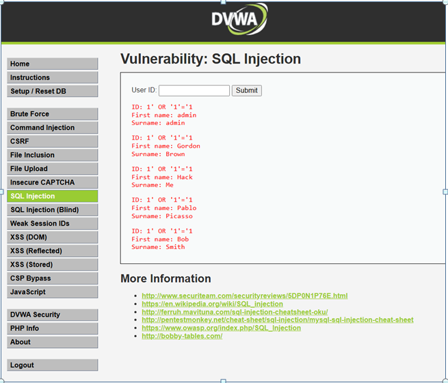

# SQL Injection en Banco Andes Capital

**Evidencia:**  
En el portal vulnerable se ingresó el payload `' OR '1'='1` en el campo *User ID*.  
El sistema devolvió múltiples registros de usuarios, demostrando acceso no autorizado a la base de datos.

**Impacto:**  
Un atacante podría extraer información sensible de clientes, como nombres y cuentas.

**Severidad (CVSS):** 9.8 – Crítico.

**Controles recomendados:**  
- Uso de consultas parametrizadas (Prepared Statements).  
- Validación estricta de entradas.  
- Monitoreo de consultas sospechosas.

